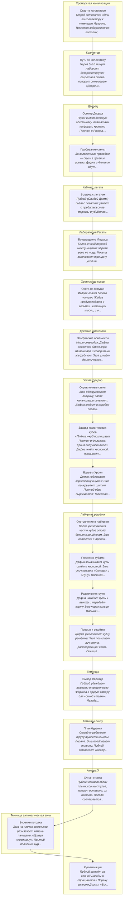

# Эпизод 51 — Подступ: диаграмма событий

```mermaid
graph TD

    subgraph ep51_l1 [Хроморская канализация]
        ep51E01["Старт в коллекторе<br/><i>Отряд готовится идти по коллектору к темницам Легиона. Тракотан забирается на потолок;...</i>"]
    end

    subgraph ep51_l2 [Коллектор]
        ep51E02["Путь по коллектору<br/><i>Через 5–10 минут лабиринт дезориентирует; секретная стена-поворот открывает «Дворец».</i>"]
    end

    subgraph ep51_l3 [Дворец]
        ep51E03["Осмотр Дворца<br/><i>Герои видят детскую обстановку, план атаки на форум, кровати Понтия и Ригора....</i>"]
        ep51E04["Пробивание стены<br/><i>За заложенным проходом — спуск в древние уровни. Дафна и Фалькон идут...</i>"]
    end

    subgraph ep51_l4 [Кабинет легата]
        ep51E05["Встреча с легатом<br/><i>Публий (Овидий Догма) пьёт с легатом; узнаёт о предательстве маркизы и убийстве...</i>"]
    end

    subgraph ep51_l5 [Лаборатория Гекаты]
        ep51E06["Возвращение Игдраса<br/><i>Болезненный переход между мирами; чёрная вена на лице. Геката залечивает трещину, уходит...</i>"]
    end

    subgraph ep51_l6 [Хранилище соков]
        ep51E07["Охота на попугая<br/><i>Игдрас ловит белого попугая; Жабра предупреждает о ведьмах, читающих мысли, и о...</i>"]
    end

    subgraph ep51_l7 [Древние катакомбы]
        ep51E08["Эльфийские орнаменты<br/><i>Ниши-созвездия; Дафна касается барельефа Шиваншара и говорит на эльфийском. Эша узнаёт демоническое...</i>"]
    end

    subgraph ep51_l8 [Узкий коридор]
        ep51E09["Отравленные стены<br/><i>Эша обнаруживает ловушку; запах канализации исчезает. Дафна входит в коридор первой.</i>"]
        ep51E10["Засада желатиновых кубов<br/><i>«Плёнка»-куб поглощает Понтия и Фалькона; Хроня получает ожоги. Дафна жжёт кислотой, призывает...</i>"]
        ep51E11["Взрывы Хрони<br/><i>Демон поджигает взрывчатку в кубах; Эша прикрывает щитом. Понтий едва вырывается; Тракотан...</i>"]
    end

    subgraph ep51_l9 [Лабиринт решёток]
        ep51E12["Отступление в лабиринт<br/><i>После уничтожения части кубов отряд бежит к решёткам. Эша остаётся с Хроней...</i>"]
        ep51E13["Погоня за кубами<br/><i>Дафна заманивает кубы огнём и кислотой; Эша уничтожает «Солнце» и «Луну» молнией...</i>"]
        ep51E14["Разделение групп<br/><i>Дафна находит путь к выходу и передаёт карту Эше через кольцо. Фалькон...</i>"]
        ep51E15["Прорыв к решётке<br/><i>Дафна уничтожает куб у решётки; Эша посылает луч света, растворяющий слизь. Понтий...</i>"]
    end

    subgraph ep51_l10 [Темницы]
        ep51E16["Вывод Фархада<br/><i>Публий убеждает вывести отравленного Фархада в другую камеру для «очной ставки». Лагада...</i>"]
    end

    subgraph ep51_l11 [Темницы снизу]
        ep51E17["План бурения<br/><i>Отряд определяет трубу туалета камеры Лорана. Эша предлагает тишину; Публий отвлекает Лагаду...</i>"]
    end

    subgraph ep51_l12 [Камера Х]
        ep51E18["Очная ставка<br/><i>Публий сажает обоих пленников на стулья, просит оставить их наедине. Лагада соглашается...</i>"]
        ep51E20["Кульминация<br/><i>Публий встаёт за спиной Лагады и обращается к Лорану голосом Догмы: «Вы...</i>"]
    end

    subgraph ep51_l13 [Темница антимагическая зона]
        ep51E19["Бурение потолка<br/><i>Эша на плечах союзников размягчает камень пальцами, образуя «лестницу»; Понтий подносит бур...</i>"]
    end

    ep51E01 --> ep51E02 --> ep51E03 --> ep51E04 --> ep51E05 --> ep51E06 --> ep51E07 --> ep51E08 --> ep51E09 --> ep51E10 --> ep51E11 --> ep51E12 --> ep51E13 --> ep51E14 --> ep51E15 --> ep51E16 --> ep51E17 --> ep51E18 --> ep51E19 --> ep51E20

```