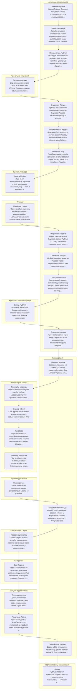

# Эпизод 52 — Клетка: диаграмма событий

```mermaid
graph TD

    subgraph ep52_l1 [Антимагическая камера]
        ep52E01["Механика удачи<br/><i>Игрок Игдраса бросает за «удачу»: исход событий при ≥10 в пользу героев....</i>"]
        ep52E02["Завязка в камере<br/><i>Лагада наливает снотворное; Лоран пугающе реагирует, выплёвывает зелье Лагаде в глаза, падает...</i>"]
        ep52E03["Первая атака Публия<br/><i>Твиструм появляется с трудом; удар в плечо холодом, цветение клинков отбрасывает Лагаду...</i>"]
        ep52E05["Внушение Лагаде<br/><i>Публий накладывает «внушение»: спасти Фархада; Лагада вызывает рвоту у короля.</i>"]
        ep52E06["Вторжение Кай Юдора<br/><i>Демон входит через пол; гончая кусает Лагаду; божественное копьё Эши по жеребьёвке...</i>"]
        ep52E07["Огненный шар<br/><i>Лагада взрывает огнём комнату; Публик обгорел (парик, грим), Кай Юдор погибает, Лагада...</i>"]
        ep52E10["Исцеление Лорана<br/><i>Лоран светом лечит Фархада, затем Публия (+12 HP); передаёт «запомни это» через...</i>"]
        ep52E11["Пленение Лагады<br/><i>Публий находит зелья на Лагаде; Лоран удерживает кинжал у её горла; согласны...</i>"]
        ep52E12["План расстановки<br/><i>Критический анализ: вспомнить расстановку Архара Горна; приказать вывести весь гарнизон во двор,...</i>"]
        ep52E14["Вторжение отряда<br/><i>Герои забираются через дыру; Лоран чистит кровь светом; псевдотруп Лорана кладут в...</i>"]
    end

    subgraph ep52_l2 [Туннель за обшивкой]
        ep52E04["Бурение снаружи<br/><i>Бур пронзает металл; Эша вызывает Кай Юдора, Дафна сигналит об упавшем стуле.</i>"]
    end

    subgraph ep52_l3 [Туннель / камера]
        ep52E08["Копьё в Публия<br/><i>Эша бьёт божественным оружием в пол; антимагия искажает удар — копьё вонзается...</i>"]
    end

    subgraph ep52_l4 [Туннель]
        ep52E09["Пробитие стены<br/><i>Удача находит полость толчковой трубы; камень пробит, металлический лист снят языком Тракотана.</i>"]
    end

    subgraph ep52_l5 [Крепость, Мачтовая улица]
        ep52E13["Выход Публия<br/><i>Выходит под видом Догмы, объявляет расстановку, покидает крепость, идёт к коллектору.</i>"]
    end

    subgraph ep52_l6 [Канализация]
        ep52E15["Починка и отдых<br/><i>Заговор «починка» на камень (~10 мин); короткий отдых; Эша лечит Фархада (16...</i>"]
        ep52E21["Пробуждение Фархада<br/><i>Фархад требователен, спорит о тоне и маршруте; Дафна обещает отвести к дочери/Венере.</i>"]
        ep52E26["Тайный план Дафны<br/><i>Дафна идёт с телами к кристаллу (убить короля ведьм?); Эша и Фалькон...</i>"]
    end

    subgraph ep52_l7 [Лаборатория Гекаты]
        ep52E16["Попугай и медведь<br/><i>Фархад в форме попугая в воде; Игдрас медвежьей мордой пугает и отпускает...</i>"]
        ep52E17["Кошмар и бюст<br/><i>Сон: друзья отплывают и превращаются в ведьм; корни крови к дубу с...</i>"]
        ep52E18["Рукоброс<br/><i>Игра «до трёх» с отрубленными руками-автоматонами; Геката бьёт молнией в ведро; Игдрас...</i>"]
        ep52E19["Разговор о сердцах<br/><i>Три сердца = три смерти, слабый организм; бюст не будит память; план...</i>"]
    end

    subgraph ep52_l8 [Хранилище Гекаты]
        ep52E20["Наблюдатель<br/><i>Запах животного, ощущение чужого присутствия; найти не удаётся.</i>"]
    end

    subgraph ep52_l9 [Канализация / город]
        ep52E22["Координация колец<br/><i>Образы через кольца: отряд в канализации, расстановка легионеров, «подожди час» у коллектора;...</i>"]
    end

    subgraph ep52_l10 [Катакомбы]
        ep52E23["Свет Лорана<br/><i>Лоран ослепительно светится; спутники угрожают оружием; Эша пытается вытащить сознание Лорана —...</i>"]
    end

    subgraph ep52_l11 [Закуток в катакомбах]
        ep52E24["Голоса издалека<br/><i>Арон шепчет как издалека; друзья зовут его к реальности; «любви будь долг...</i>"]
        ep52E25["Пощёчина Арона<br/><i>Арон бьёт Дафну; Аранда говорит «любимый» и требует план; Фалькона уводят в...</i>"]
    end

    subgraph ep52_l12 [Торговый союз / канализация]
        ep52E27["Финал<br/><i>Публий торгует тростью; отряд спешит к коллектору с пленниками — «узнаем в...</i>"]
    end

    ep52E01 --> ep52E02 --> ep52E03 --> ep52E04 --> ep52E05 --> ep52E06 --> ep52E07 --> ep52E08 --> ep52E09 --> ep52E10 --> ep52E11 --> ep52E12 --> ep52E13 --> ep52E14 --> ep52E15 --> ep52E16 --> ep52E17 --> ep52E18 --> ep52E19 --> ep52E20 --> ep52E21 --> ep52E22 --> ep52E23 --> ep52E24 --> ep52E25 --> ep52E26 --> ep52E27

```