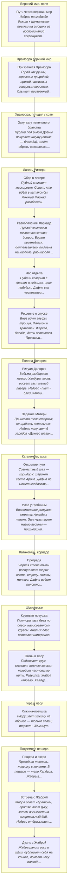

# Эпизод 53 — Преграда: диаграмма событий

```mermaid
graph TD

    subgraph ep53_l1 [Верхний мир, поля]
        ep53E01["Путь через верхний мир<br/><i>Игдрас на медведе бежит к Шумолесью; прыжки на эмоциях из воспоминаний сокращают...</i>"]
    end

    subgraph ep53_l2 [Храморра верхний мир]
        ep53E02["Призрачная Храморра<br/><i>Город как руины, заросшие природой; проход насквозь к северным воротам. Слышит призрачный...</i>"]
    end

    subgraph ep53_l3 [Храморра, гильдия / храм]
        ep53E03["Закупка у пепельного братства<br/><i>Публий под видом Догмы покупает шхуну (отказ — блокада), шлёт образы союзникам....</i>"]
    end

    subgraph ep53_l4 [Лагерь Риггера]
        ep53E04["Сбор в лагере<br/><i>Публий снимает маскировку. Совет: кто идёт в катакомбы. Ложный Фархад разоблачён.</i>"]
        ep53E05["Разоблачение Фархада<br/><i>Публий замечает несоответствия; допрос. Борат признаётся: доппельгангер, подмена на корабле, раб короля....</i>"]
        ep53E06["Час отдыха<br/><i>Публий говорит с Ароном о ведьмах, цене победы и Дафне как «основании...</i>"]
        ep53E07["Решение о спуске<br/><i>Вниз идут эльфы, троица, Фалькон и Тракотан. Фархад, Лагада, дети остаются. Провизии...</i>"]
    end

    subgraph ep53_l5 [Поляна Долорес]
        ep53E08["Ритуал Долорес<br/><i>Ведьма разбирает живого Халдура; кровь рисует застывший лагерь. Игдрас «пьёт» след Жабры...</i>"]
        ep53E09["Задание Матери<br/><i>Принести тело старика; не щадить остальных. Игдрас получает 6 зарядов «Дикого шага»...</i>"]
    end

    subgraph ep53_l6 [Катакомбы, арка]
        ep53E10["Открытие пути<br/><i>Совместный шаг — коридор с шариком света Арона. Дафна не может колдовать...</i>"]
        ep53E11["Ужас у гробницы<br/><i>Воспоминание ритуала смерти; Аранда в панике. Эша чувствует магию ведьмы — мощнейший...</i>"]
    end

    subgraph ep53_l7 [Катакомбы, коридор]
        ep53E12["Преграда<br/><i>Чёрная стена тьмы расщепляет шарик света, стрелу, волосы, молнию. Дафна видит полотно...</i>"]
    end

    subgraph ep53_l8 [Шумолесье]
        ep53E13["Круговая ловушка<br/><i>Полтора часа бега по следу, нарисованному кругом. Анализ: след оставлен намеренно.</i>"]
        ep53E14["Огонь в лесу<br/><i>Поджигает круг, сжигает ложные запахи; находит настоящую нить. Развилка: Жабра направо, Халдур...</i>"]
    end

    subgraph ep53_l9 [Гора в лесу]
        ep53E15["Хижина-ловушка<br/><i>Разрушает хижину на обрыве — только саван; теряет ~30 минут.</i>"]
    end

    subgraph ep53_l10 [Подземная пещера]
        ep53E16["Пещера и озеро<br/><i>Проходит тоннель, ловушку с кольями. В пещере — тело Халдура, Жабра в...</i>"]
        ep53E17["Встреча с Жаброй<br/><i>Жабра зовёт «братом», протягивает руку, затем вызывает на смертельный бой. Игдрас отбрасывает...</i>"]
        ep53E18["Дуэль с Жаброй<br/><i>Жабра ранит руку и щёки, дублирует себя на клинке, ломает ногу палкой,...</i>"]
    end

    ep53E01 --> ep53E02 --> ep53E03 --> ep53E04 --> ep53E05 --> ep53E06 --> ep53E07 --> ep53E08 --> ep53E09 --> ep53E10 --> ep53E11 --> ep53E12 --> ep53E13 --> ep53E14 --> ep53E15 --> ep53E16 --> ep53E17 --> ep53E18

```