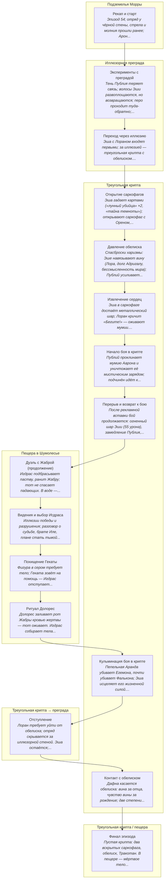

# Эпизод 54 — Раскол: диаграмма событий

```mermaid
graph TD

    subgraph ep54_l1 [Подземелья Морры]
        ep54E01["Рекап и старт<br/><i>Эпизод 54; отряд у чёрной стены, стрела и молния прошли ранее; Арон...</i>"]
    end

    subgraph ep54_l2 [Иллюзорная преграда]
        ep54E02["Эксперименты с преградой<br/><i>Тень Публия теряет связь; волосы Эши развоплощаются, но возвращаются; перо проходит туда-обратно;...</i>"]
        ep54E03["Переход через иллюзию<br/><i>Эша с Лораном входят первыми; за иллюзией — треугольная крипта с обелиском....</i>"]
    end

    subgraph ep54_l3 [Треугольная крипта]
        ep54E04["Открытие саркофагов<br/><i>Эша гадает картами («лунный убийца» ×2, «тайна темноты»); открывают саркофаг с Ореном,...</i>"]
        ep54E05["Давление обелиска<br/><i>Спасброски харизмы: Эше навязывают вину (Лора, долг Адригалу, бессмысленность мира); Публий усиливает...</i>"]
        ep54E06["Извлечение сердец<br/><i>Эша в саркофаге достаёт металлический шар; Лоран кричит «Бегите!» — оживают мумии....</i>"]
        ep54E07["Начало боя в крипте<br/><i>Публий проклинает мумию Аарона и уничтожает её мистическим зарядом; подчинён идёт к...</i>"]
        ep54E08["Перерыв и возврат к бою<br/><i>После рекламной вставки бой продолжается: огненный шар Эши (55 урона), замедление Публия,...</i>"]
        ep54E13["Кульминация боя в крипте<br/><i>Пепельная Аранда убивает Егемона, почти убивает Фалькона; Эша исцеляет его жизненной силой....</i>"]
        ep54E15["Контакт с обелиском<br/><i>Дафна касается обелиска: вина за отца, чувство вины за рождение; две степени...</i>"]
    end

    subgraph ep54_l4 [Пещера в Шумолесье]
        ep54E09["Дуэль с Жаброй (продолжение)<br/><i>Игдрас подбрасывает паству, ранит Жабру; тот не спасает падающих. В воде —...</i>"]
        ep54E10["Видения и выбор Игдраса<br/><i>Иллюзии победы и разрушения; разговор о судьбе, брате Иле, плане стать тьмой...</i>"]
        ep54E11["Похищение Гекаты<br/><i>Фигура в сером требует тело; Геката зовёт на помощь — Игдрас отступает...</i>"]
        ep54E12["Ритуал Долорес<br/><i>Долорес заливает рот Жабры кровью жертвы — тот оживает. Игдрас собирает тела...</i>"]
    end

    subgraph ep54_l5 [Треугольная крипта → преграда]
        ep54E14["Отступление<br/><i>Лоран требует уйти от обелиска; отряд скрывается за иллюзорной стеной. Эша остаётся;...</i>"]
    end

    subgraph ep54_l6 [Треугольная крипта / пещера]
        ep54E16["Финал эпизода<br/><i>Пустая крипта: два вскрытых саркофага, обелиск, Тракотан. В пещере — мёртвое тело...</i>"]
    end

    ep54E01 --> ep54E02 --> ep54E03 --> ep54E04 --> ep54E05 --> ep54E06 --> ep54E07 --> ep54E08 --> ep54E09 --> ep54E10 --> ep54E11 --> ep54E12 --> ep54E13 --> ep54E14 --> ep54E15 --> ep54E16

```