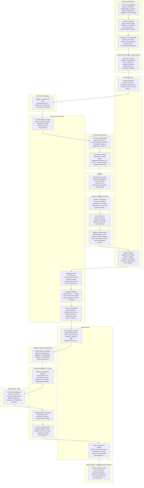

# Эпизод 55 — Обелиск: диаграмма событий

```mermaid
graph TD

    subgraph ep55_l1 [Пещера в Шумолесье]
        ep55E01["Ритуал над Жаброй<br/><i>Долорес оживляет Жабру кровью паствы; Игдрас наблюдает и подбирает тело Халдура</i>"]
        ep55E02["Явление Матери<br/><i>Мать читает разум Игдраса; он скрывает воспоминания о Пришедшей Ау и озере;...</i>"]
        ep55E03["Поручение и уход Матери<br/><i>До полуночи нужно узнать планы врагов у Жабры; Мать телепортируется прочь</i>"]
    end

    subgraph ep55_l2 [Пещера в Шумолесье / разум Игдраса]
        ep55E04["Крепость из стужи<br/><i>Игдрас отгораживает часть памяти от «спрута» Матери; обретает зону холодного контроля</i>"]
    end

    subgraph ep55_l3 [Поляна у костра]
        ep55E05["Костёр и видение<br/><i>Игдрас сжигает в пламени воспоминания о слабости; видит Мать в огне и...</i>"]
        ep55E14["Допрос Жабры<br/><i>Игдрас поит Жабру; узнаёт о ферме-крепости, единстве четверых, предателе и пути пророка</i>"]
    end

    subgraph ep55_l4 [Магический коридор]
        ep55E06["Выход из магической тьмы<br/><i>Группа выходит из завесы; все потрясены — Эша вошла в обелиск</i>"]
    end

    subgraph ep55_l5 [Лагерь банды Ригора]
        ep55E07["Песчаная буря в лагере<br/><i>Мумия атакует; Дафна перчаткой ветра сдувает вихрь в канализацию</i>"]
        ep55E15["Возвращение из канализации<br/><i>Группа в грязи; Лоран обожжён; мумия уничтожена; решают идти к обелиску за...</i>"]
        ep55E16["Природа обелиска<br/><i>Арон: обелиск — магнит для болезненных частей души; разрушать нельзя — потеряют...</i>"]
        ep55E17["План спасения Эши<br/><i>Идеи: светлые воспоминания, песни, поэзия, контакт с Каюдором; идут к обелиску звать...</i>"]
    end

    subgraph ep55_l6 [Канализация Храморы]
        ep55E08["Погоня в канализации<br/><i>Группа настигает мумию; Дафна по приказу поджигает Лорана, затем бьёт огнём по...</i>"]
        ep55E09["Уничтожение мумии<br/><i>Совместная атака; мумия дефрагментируется; из пепла — видение войны и деревенского дома</i>"]
    end

    subgraph ep55_l7 [Обелиск]
        ep55E10["Вход Эши в обелиск<br/><i>После видения Дафна шагает внутрь; оказывается у жертвенного алтаря с кровью агнца</i>"]
    end

    subgraph ep55_l8 [Внутренний мир обелиска]
        ep55E11["Встреча с Каюдором<br/><i>Учитель помогает спуститься с алтаря; объясняет, что они оба призраки в мире...</i>"]
        ep55E12["Залы Кайллоса<br/><i>Лунные эльфы в расцвете; Каюдор говорит о душе как о воспоминании</i>"]
        ep55E13["Дворец и карта войны<br/><i>Воспоминание: план обороны Чёрного берега; флот Волатара; шпион среди соратников империи</i>"]
    end

    subgraph ep55_l9 [Чёрный берег]
        ep55E18["Речь Аранды войскам<br/><i>Аранда обращается через шар апостофа; говорит с сыном о любви, ответственности и...</i>"]
        ep55E24["Битва Аннабетта и демона<br/><i>Демон и паладин в танце разрушения; воронка света и тьмы; цунами вмешивается...</i>"]
    end

    subgraph ep55_l10 [Корабли Священной Империи]
        ep55E19["Срыв плана со шпионом<br/><i>Дивнус отказывается предавать императора; девушка с виноградной лозой атакует его</i>"]
    end

    subgraph ep55_l11 [Шатёр матери на поле битвы]
        ep55E20["Жертва тринадцати видящих<br/><i>Мать режет горло тринадцати юным видящим; из их крови — двенадцать демонов...</i>"]
        ep55E22["Конфронтация с Матерью<br/><i>Аранда обвиняет «сестру» в провале плана и гибели детей</i>"]
        ep55E23["Ритуал над Магрипом<br/><i>Аранда отводит сына в шатёр; слышит его крик — рождается Граур Бугразурфаль</i>"]
    end

    subgraph ep55_l12 [Чёрный берег / море]
        ep55E21["Отступление Дивнуса<br/><i>Дивнус по сигналу шпионши уводит флот Ордена Соцветия; история в воспоминании искажена</i>"]
    end

    subgraph ep55_l13 [Чёрный берег / внутренний мир обелиска]
        ep55E25["Эша в эпицентре боли<br/><i>Эша пытается различить черты монстра и Аннабетта; боль заполняет всё пространство —...</i>"]
    end

    ep55E01 --> ep55E02 --> ep55E03 --> ep55E04 --> ep55E05 --> ep55E06 --> ep55E07 --> ep55E08 --> ep55E09 --> ep55E10 --> ep55E11 --> ep55E12 --> ep55E13 --> ep55E14 --> ep55E15 --> ep55E16 --> ep55E17 --> ep55E18 --> ep55E19 --> ep55E20 --> ep55E21 --> ep55E22 --> ep55E23 --> ep55E24 --> ep55E25

```